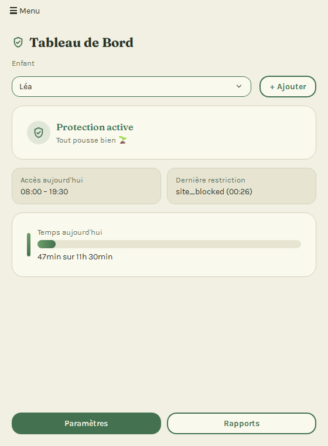
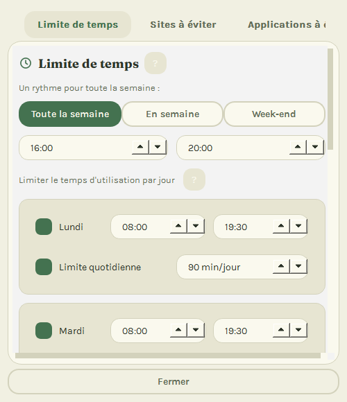
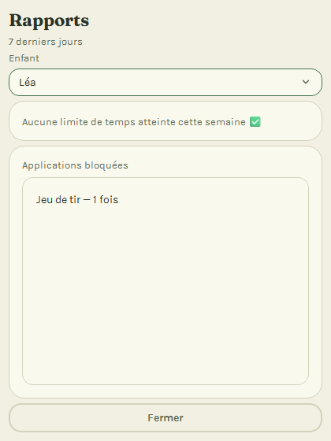

# MintGuard

[Français](README.md) · [English](README.en.md) · [Deutsch](README.de.md)

[](https://github.com/tavenamicka/MintGuard/actions/workflows/ci.yml)
[](LICENSE)

Aplicación de control parental para Linux Mint — sencilla y accesible para padres sin conocimientos técnicos, con límite de tiempo de pantalla y bloqueo de sitios web y aplicaciones, disponible en 4 idiomas (FR/EN/DE/ES).

> Estado: Fase 3 (Seguridad e Integración) terminada, Fase 4 (Pruebas y Lanzamiento) en curso — cambio de DNS, iptables, auditoría de seguridad y auditoría de accesibilidad validados. Consulte [PROJECT_BRIEF.md](PROJECT_BRIEF.md) para las especificaciones completas y [CLAUDE_CODE_BRIEFING.md](CLAUDE_CODE_BRIEFING.md) para el plan de implementación por fases (ambos en francés).

## Vista general

Capturas de la interfaz para padres, con datos ficticios. La interfaz se muestra en su idioma (francés, inglés, alemán o español).

| Panel principal | Ajustes: límite de tiempo | Informes |
|---|---|---|
|  |  |  |

## Instalar MintGuard (padres)

No hacen falta conocimientos de informática: siga estos 5 pasos, en orden. Calcule unos 10 minutos.

**Antes de empezar**, compruebe que:
- su ordenador funciona con **Linux Mint** (o Ubuntu) y está conectado a Internet;
- conoce la **contraseña** que escribe para iniciar sesión;
- cada hijo tiene **su propia cuenta** en el ordenador (así MintGuard sabe quién lo está usando).

1. **Descargue el archivo de instalación.** Abra la [página de versiones](https://github.com/tavenamicka/MintGuard/releases/latest), baje hasta «Assets» y haga clic en el archivo `mintguard_0.1.0-1_all.deb`. Se guarda en la carpeta **Descargas**.
2. **Inicie la instalación.** En la carpeta Descargas, haga doble clic en ese archivo. Se abre una ventana: haga clic en **Instalar**, escriba su contraseña y espere a que termine (alrededor de un minuto).
3. **Abra MintGuard.** Haga clic en el menú del ordenador (abajo a la izquierda), escriba «MintGuard» y haga clic en el icono.
4. **Responda a las preguntas del asistente.** Le pide el nombre de su hijo, su edad (para elegir ajustes adecuados) y un **código PIN** de 4 dígitos. Anótelo en papel: protege sus ajustes.
5. **Active la protección.** Si aparece el mensaje «La protección aún no está activada», haga clic en **«Activar la protección ahora»** y escriba su contraseña. Listo: MintGuard se iniciará solo cada vez que arranque el ordenador.

¿Algún problema? Consulte la [guía de instalación](docs/INSTALLATION.es.md), que explica qué hacer paso a paso.

## Guía del usuario

Para padres: [Français](docs/USER_MANUAL_FR.md) · [English](docs/USER_MANUAL_EN.md) · [Deutsch](docs/USER_MANUAL_DE.md) · [Español](docs/USER_MANUAL_ES.md)

## Arquitectura

```
Interfaz (PyQt6, padres)
        │  D-Bus / Socket
Daemon backend (systemd, root)
   ├── DNS Controller (dnsmasq)
   ├── Firewall Controller (iptables)
   ├── Process Monitor (psutil)
   └── Session Manager (loginctl)
```

## Instalación (desarrollo)

```bash
python -m venv .venv
source .venv/bin/activate    # .venv\Scripts\activate (Windows)
pip install -e .
pip install -r requirements.txt
```

## Ejecutar las pruebas

```bash
pytest tests/ -v
pytest tests/ --cov=mintguard
```

## Ejecutar la aplicación (desarrollo)

```bash
mintguard              # interfaz
python -m mintguard.daemon   # daemon (no requiere root en desarrollo)
```

En desarrollo, se puede cambiar la ruta del archivo de configuración:

```bash
export MINTGUARD_CONFIG_PATH=/tmp/mintguard-config.json
```

Sin esta variable, MintGuard intenta leer `/etc/mintguard/config.json` y usa los valores por defecto si no existe (véase [etc/config.json.example](etc/config.json.example)).

## Estructura del proyecto

Véase [PROJECT_BRIEF.md](PROJECT_BRIEF.md), sección «Structure de Répertoires» (en francés).

## Para colaboradores

Véase [docs/DEV_SETUP.md](docs/DEV_SETUP.md) (configuración en 5 minutos) y [CONTRIBUTING.md](CONTRIBUTING.md).

## Licencia

MintGuard se distribuye bajo la [Licencia Pública General de GNU v3.0 o posterior](LICENSE) (GPL-3.0-or-later). Véase [docs/LICENSE_COMPLIANCE.md](docs/LICENSE_COMPLIANCE.md) para la compatibilidad de las dependencias y [AUTHORS.md](AUTHORS.md) para los colaboradores.
